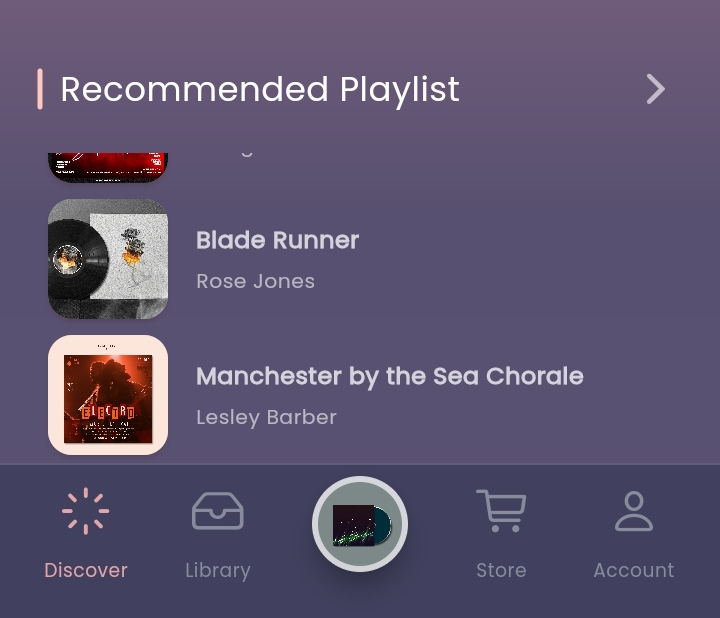

<!--
This README describes the package. If you publish this package to pub.dev,
this README's contents appear on the landing page for your package.

For information about how to write a good package README, see the guide for
[writing package pages](https://dart.dev/guides/libraries/writing-package-pages).

For general information about developing packages, see the Dart guide for
[creating packages](https://dart.dev/guides/libraries/create-library-packages)
and the Flutter guide for
[developing packages and plugins](https://flutter.dev/developing-packages).
-->

A Flutter BottomNavigation package with extra functions and flexibility and ease of usage.

## Features

- Supports every other widgets aside Icon as [BottomNavigation] Item
- Supports [BottomNavigation] top [Divider] widget.
- Support [BottomNavItem] custom background which can either be enable or disabled.
- [BottomNavigation] Background can be fully customized, images can be applied likewise gradient colors.

### Screenshots




## Getting started

To get started with this package just set it up in your [pubspec.yaml] file, thus:

### Dependency

```yaml
  bottom_nav:
    git:
      url: git@github.com:kenresoft/bottom_nav.git
      ref: master
```

## Usage

```dart
 class BottomNavExample extends StatelessWidget {
  const BottomNavExample({Key? key}) : super(key: key);

  @override
  Widget build(BuildContext context) {
    return BottomNav(
      labelStyle: const TextStyle(fontStyle: FontStyle.italic),
      height: 82,
      padding: const EdgeInsets.all(25).copyWith(top: 5, bottom: 5),
      backgroundSelected: Colors.blue.shade900,
      divider: const Divider(height: 0),
      borderRadius: const BorderRadius.only(topRight: Radius.circular(20), topLeft: Radius.circular(20)),
      onTap: (index) => buildNavSwitch(index, context, widget.ref),
      iconSize: 23,
      labelSize: 20,
      backgroundColor: Colors.white.withOpacity(0.2),
      color: Colors.white.withOpacity(0.5),
      colorSelected: Colors.white,
      indexSelected: widget.ref.watch(tabProvider.select((value) => value)),
      items: const [
        BottomNavItem(label: 'Home', child: CupertinoIcons.home),
        BottomNavItem(label: 'Book', child: CupertinoIcons.book),
        BottomNavItem(label: 'Bubble', child: CupertinoIcons.bubble_left),
        BottomNavItem(label: 'Bookmark', child: CupertinoIcons.bookmark),
      ],
    );
  }
}

```

## Additional information

This package is not hosted on the pub.dev site yet.
Feel free to add in your suggestions, contributions and support.
We keep upgrading this package for better performance even as the dart and flutter frameworks are been updated for the community.
